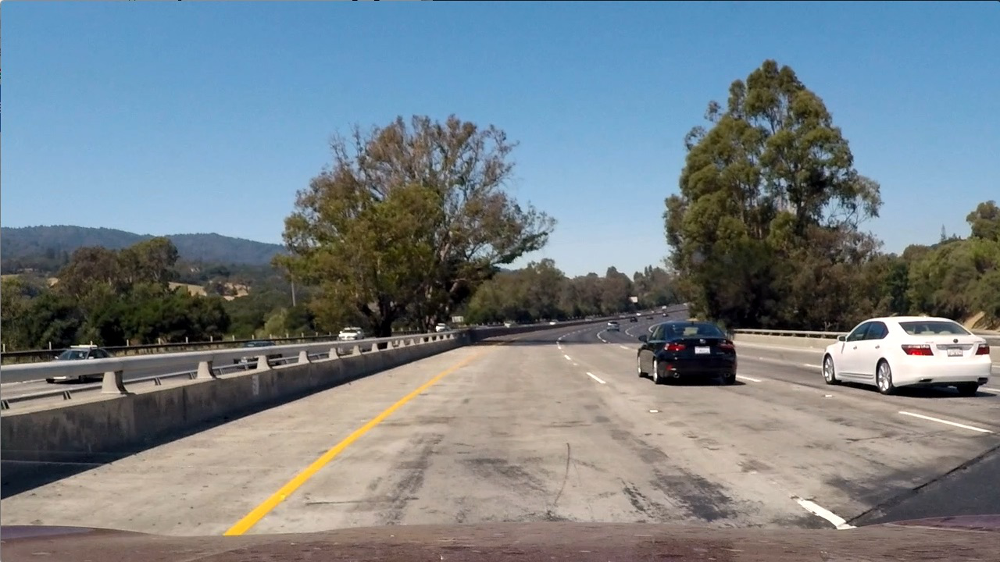
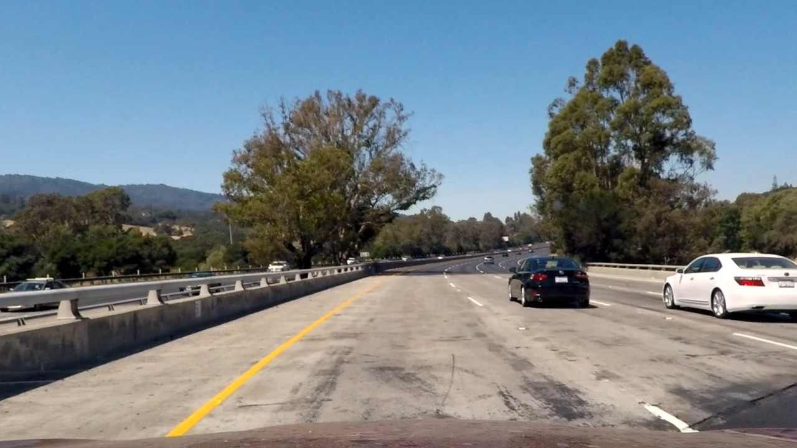

# Advanced Lane Finder

In this project I use the following steps to find the lanes on an image or video stream.

* Compute the camera calibration matrix and distortion coefficients given a set of chessboard images.
* Apply a distortion correction to raw images.
* Use color transforms, gradients, etc., to create a thresholded binary image.
* Apply a perspective transform to rectify binary image ("birds-eye view").
* Detect lane pixels and fit to find the lane boundary.
* Determine the curvature of the lane and vehicle position with respect to center.
* Warp the detected lane boundaries back onto the original image.
* Output visual display of the lane boundaries and numerical estimation of lane curvature and vehicle position.

[//]: # (Image References)

[image1]: ./writeup_images/UndistortedImage.png "Undistorted"
[image2]: ./writeup_images/OriginalImage.png "Original"
[image3]: ./writeup_images/binary_image.png "Binary"
[image4]: ./writeup_images/fit_lines.png "Fit Lines"
[image5]: ./writeup_images/no_warp_points.png "No Warp with Points"
[image6]: ./writeup_images/warped_points.png "Warped Points"
[video1]: ./project_video_output.mp4 "Video"

---

### 1. Camera Calibration

The first step to getting accurate lane lines using computer vision is to correct the distortion caused by the camera lens. This distortion warps the image so that it isn't an accurate 2D projection of the 3D scene. The code for this section is in the first cell of the IPython notebook located in my IPython Notebook. 

Camera calibration is done by taking images of a chessboard at from many different angles and locations and detecting the corners of the chessboard in the image, comparing it with the known properties of chessboard corners and computing the calibration matrix. I first start by preparing the "image points" which are the locations of the chessboard corners, and the "object points" which will be the (x,y,z) coordinates of the chessboard corners in the world, assuming that the chessboard is fixed on the plane z=0. 

Using the object points and the image points the camera calibration and distortion coefficients are computed using the opencv functions cv2.calibrateCamera(). With these coefficients we can apply the distortion correction to an image using cv2.undistort(). On the left you will see the original image that still has warping effects from the camera. On the right is the undistorted image that has this distortion corrected. 

  

### 2. Binary Thresholding

The next step is to create a binary thresholded image out of my undistorted image. Binary thresholded means that each pixel is either a 1 or a 0. A 1 meaning ideally that that pixel is part of a lane. This will help us later when we try to fit lane lines to the image. There are many different ways to create a binary thresholded image. For this project I used a couple and combined them together to get a more robust method. My functions for performing these different thresholding processes are defined in the 2nd cell and called in 5th cell lines 9-21 of advanced-lane-finder.ipynb. 

I used an HLS colorspace S channel and an RGB colorspace R channel each thresholded between min and max pixel values combined with Sobel X and Y operators similarly thresholded. Together these proved to be a robust method of getting the lane lines even with changing road conditions. 

Here is an example of the result:

![alt text][image3]

### 3. Perspect Transform

The next step is to transform the image into a top down "birds eye view" of the road. This allows us to find the lane lines and measure their curvature in the (X,Y) plane which is what we care about. This section is defined in lines 23 - 32 in the 5th cell of the IPython Notebook. The perspective transform is performed using OpenCV's cv2.getPerspectiveTransform() which takes in a set of source points which defines a parallelogram that we will transform into a rectangle in the new image (defined by 4 destination points), transforming the whole image with it into a new perspective. The source points were chosen by observing an example of an image with straight lines and finding a set of four points each on the lane lines like so:

![alt text][image5]

The destination points were set up in a rectangle and defined where the lane lines would show up in my image. These were set up such that the resulting image entirely focused on the region of interest where lane lines might be found.

This resulted in the following source and destination points:

| Source        | Destination   | 
|:-------------:|:-------------:| 
| 300, 655      | 200, 680      | 
| 1005, 655     | 1000, 680     |
| 685, 450      | 1000, 0       |
| 595, 450      | 200, 0        |

After warping an image into a birds eye view perspective the image transforms to something like this:

![alt text][image6]

#### 4. Describe how (and identify where in your code) you identified lane-line pixels and fit their positions with a polynomial?

Then I did some other stuff and fit my lane lines with a 2nd order polynomial kinda like this:

![alt text][image5]

#### 5. Describe how (and identify where in your code) you calculated the radius of curvature of the lane and the position of the vehicle with respect to center.

I did this in lines # through # in my code in `my_other_file.py`

#### 6. Provide an example image of your result plotted back down onto the road such that the lane area is identified clearly.

I implemented this step in lines # through # in my code in `yet_another_file.py` in the function `map_lane()`.  Here is an example of my result on a test image:

![alt text][image6]

---

### Pipeline (video)

#### 1. Provide a link to your final video output.  Your pipeline should perform reasonably well on the entire project video (wobbly lines are ok but no catastrophic failures that would cause the car to drive off the road!).

Here's a [link to my video result](./project_video.mp4)

---

### Discussion

#### 1. Briefly discuss any problems / issues you faced in your implementation of this project.  Where will your pipeline likely fail?  What could you do to make it more robust?

Here I'll talk about the approach I took, what techniques I used, what worked and why, where the pipeline might fail and how I might improve it if I were going to pursue this project further.  
