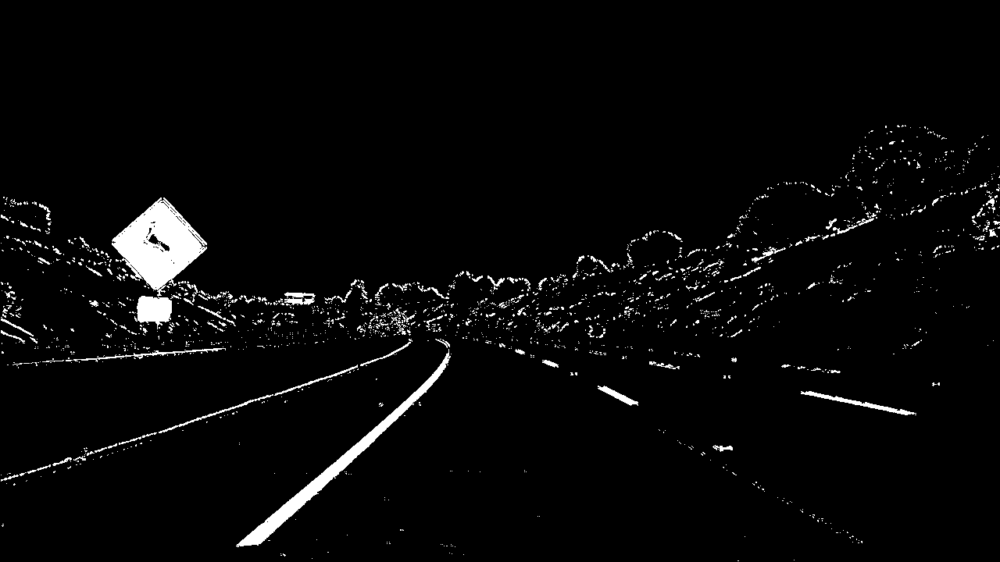
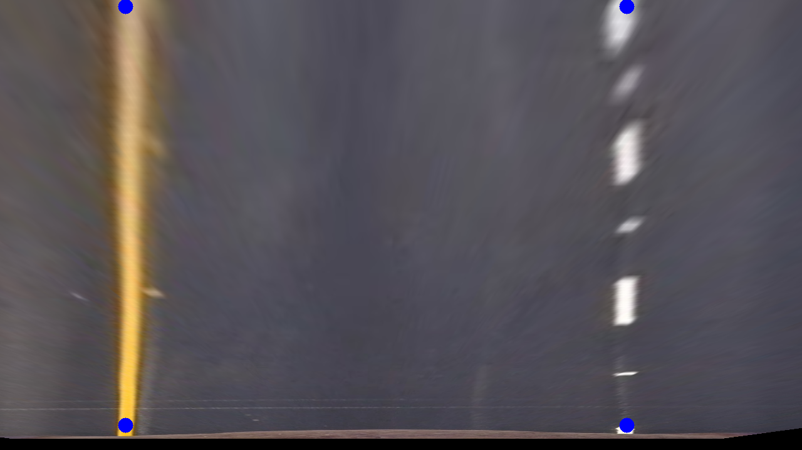

# Advanced Lane Finder

In this project I use the following steps to find the lanes on an image or video stream.

* Compute the camera calibration matrix and distortion coefficients given a set of chessboard images.
* Apply a distortion correction to raw images.
* Use color transforms, gradients, etc., to create a thresholded binary image.
* Apply a perspective transform to rectify binary image ("birds-eye view").
* Detect lane pixels and fit to find the lane boundary.
* Determine the curvature of the lane and vehicle position with respect to center.
* Warp the detected lane boundaries back onto the original image.
* Output visual display of the lane boundaries and numerical estimation of lane curvature and vehicle position.

[//]: # (Image References)

[image1]: ./writeup_images/UndistortedImage.png "Undistorted"
[image2]: ./writeup_images/OriginalImage.png "Original"
[image3]: ./writeup_images/binary_image.png "Binary"
[image4]: ./writeup_images/fit_lines.png "Fit Lines"
[image5]: ./writeup_images/no_warp_points.png "No Warp with Points"
[image6]: ./writeup_images/warped_points.png "Warped Points"
[image7]: ./writeup_images/output_example.png "Output Example"
[video1]: ./project_video_output.mp4 "Video"

---

### 1. Camera Calibration

The first step to getting accurate lane lines using computer vision is to correct the distortion caused by the camera lens. This distortion warps the image so that it isn't an accurate 2D projection of the 3D scene. The code for this section is in the first cell of the IPython notebook located in my IPython Notebook. 

Camera calibration is done by taking images of a chessboard from many different angles and locations and detecting the corners of the chessboard in the image, comparing it with the known properties of chessboards and computing the calibration matrix. I first start by preparing the "image points" which are the locations of the chessboard corners, and the "object points" which will be the (x,y,z) coordinates of the chessboard corners in the world, assuming that the chessboard is fixed on the plane z=0. 

Using the object points and the image points, the camera calibration and distortion coefficients are computed using the opencv function cv2.calibrateCamera(). With these coefficients we can apply the distortion correction to an image using cv2.undistort(). On the left you will see the original image that still has warping effects from the camera. On the right is the undistorted image that has this distortion corrected. You'll notice a slight difference in the image especially at the edges.

  

### 2. Binary Thresholding

The next step is to create a binary thresholded image out of my undistorted image. Binary thresholding means that each pixel is either a 1 or a 0. A 1 meaning ideally that that pixel is part of a lane. This will help us later when we try to fit lane lines to the image. There are many different ways to create a binary thresholded image. For this project I used several different thresholding methods and combined them together to get a more robust thresholding. My functions for performing these different thresholding processes are defined in the 2nd cell and called in 5th cell lines 9-21 of my IPython notebook. 

I used an HLS colorspace S channel and an RGB colorspace R channel each thresholded between min and max pixel values combined with Sobel X and Y operators similarly thresholded. Combined these proved to be a robust method of getting the lane lines even with changing road conditions. 

Here is an example of the result:

### 3. Perspect Transform

The next step is to transform the image into a top down "birds eye view" of the road. This allows us to find the lane lines and measure their curvature in the (X,Y) plane. This section is defined in lines 23 - 32 of the 5th cell of the IPython Notebook. The perspective transform is performed using OpenCV's cv2.getPerspectiveTransform() which takes in a set of source points defining a parallelogram that we will transform into a rectangle in the new image (defined by 4 destination points) This transforms the whole image with it into a new perspective. The source points were chosen by observing an example of an image with straight lines and finding a set of four points each on the lane lines like so:

The destination points were set up in a rectangle and defined where the lane lines would show up in my image. These were set up such that the resulting image entirely focused on the region of interest where lane lines might be found.

This resulted in the following source and destination points:

| Source        | Destination   | 
|:-------------:|:-------------:| 
| 300, 655      | 200, 680      | 
| 1005, 655     | 1000, 680     |
| 685, 450      | 1000, 0       |
| 595, 450      | 200, 0        |

After performing the perspective transform the image is transformed into a top down perspective like this:

#### 4. Lane Fitting

After my binary thresholded image is transformed into a birds eye view perspective I next find the lane lines using a sliding histogram approach. The function for this is defined in the 3rd cell of my IPython notebook. The code for this section (as well as the project video) came from Udacity. In this function a sliding window is used starting from the lower part of the image to find the peak in the number of pixels. It is then moved up and slides along the x-axis focusing on the area near where the peak was in the next lower section. This helps the algorithm to not get pulled away by other side patches that might have remained in the thresholded image. Eventually we have a set of points that we can fit a polynomial to and we can draw lane lines on the image: 

#### 5. Calculating the curvature and the vehicle's position:

This section was implemented in the 3rd cell of the IPython notebook in lines 75-100. We have the lane lines polynomials from the image before, but this needs to be converted from pixel space to world space. An assumption of 3.7m for lane width and 3m for dashed line is used for the conversion. After this is done the curvature is estimated in real world space.

The camera is assumed to be in the center of the vehicle, (though that seems to be not quite true) and the left and right beginning of the lines is found from the polynomials we fit earlier. Taking the average of the left and right x intercepts (the center of the lane) and subtracting the center of the image returns the difference between the two and the distance the vehicle is from center is calculated.

#### 6. Example of final output:

Finally the lane lines are projected onto the original undistorted image and the lane line and curvature is found. In this image the curvature is estimated at 10386m and the car is estimated at 56 cm off from the center of the lane. 

![alt text][image7]

---

### Video

#### 1. Final Result

Here's a [link to my video result](./project_video_output.mp4)

---

### Discussion

#### 1. Possible failures and future work:

One of the possible failures in my implementation is with the flat plane assumption I use in selecting the 4 points for my perspective transform. In upward hills or bumpy road areas this assumption fails and could cause issues. But the main failure point is likely to be the thresholding. It's difficult if not impossible to threshold just the lane lines using only computer vision techniques so likely the best way would be to have more continuity between streams so that if there is a stream or two that seems really off from the last one it is ignored as a false lane fitting.
